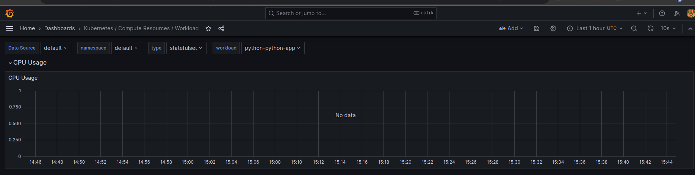
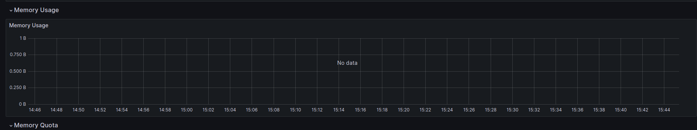
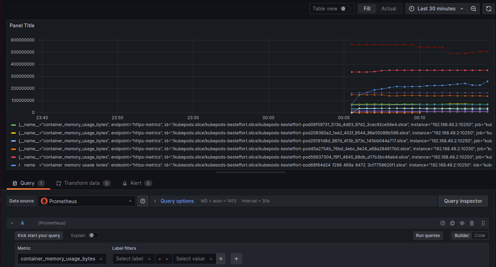
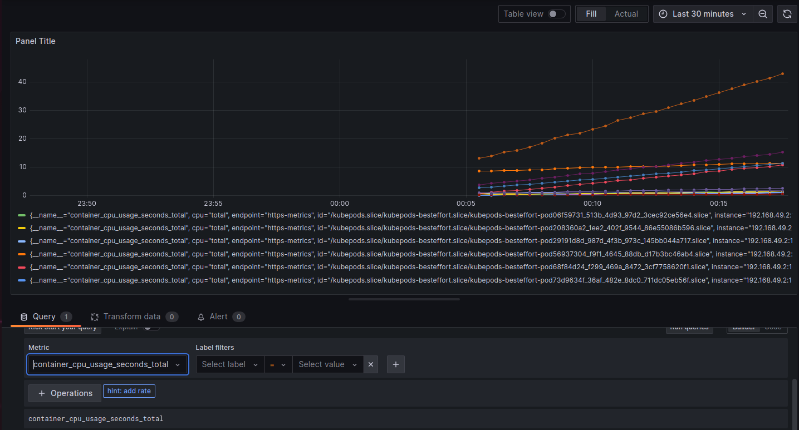
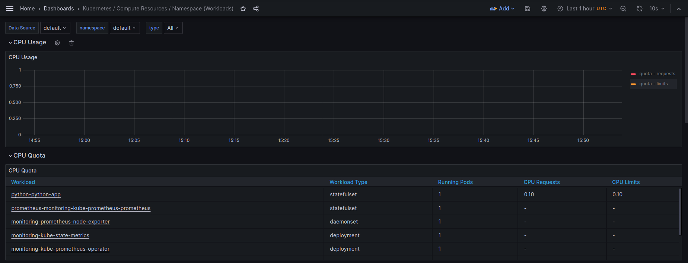
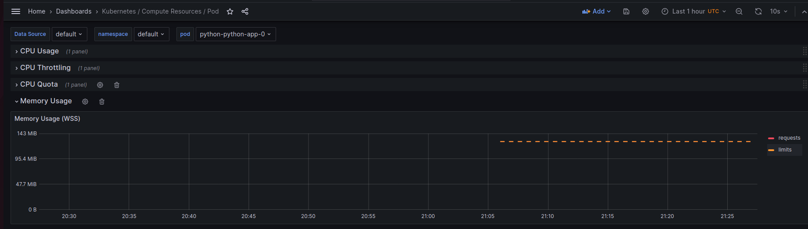
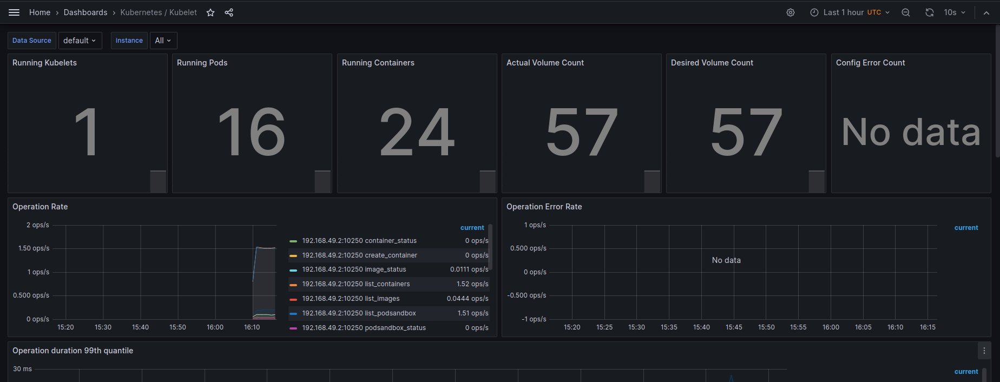
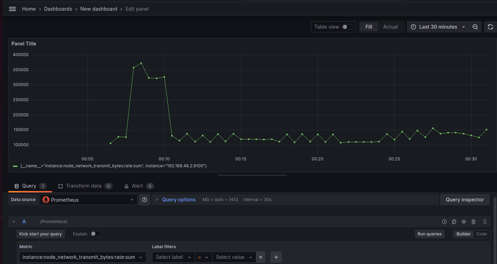
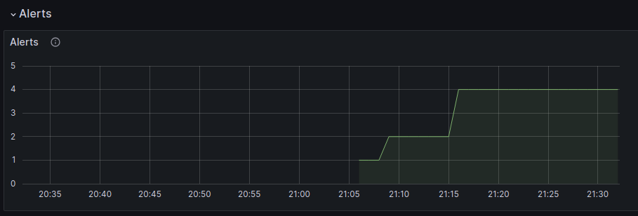
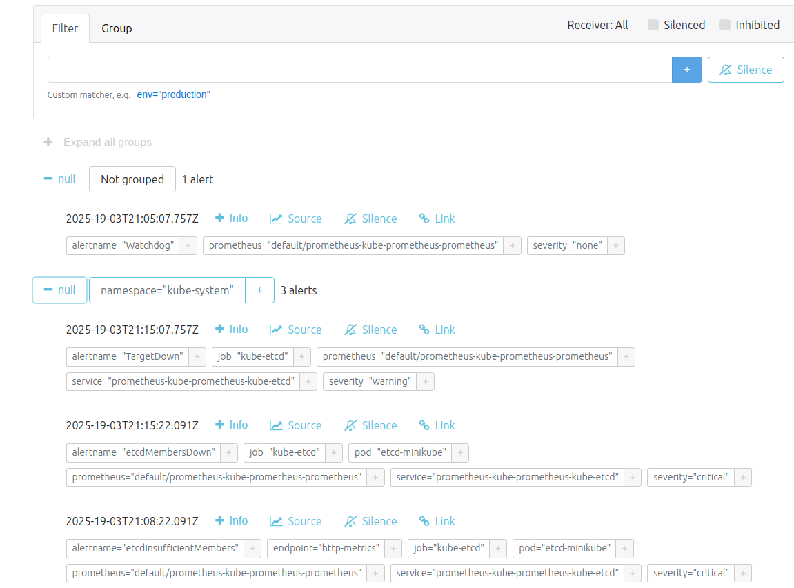

# Kubernetes Monitoring and Init Containers

## Monitoring Kubernetes with Prometheus

### Key Components of the Kube Prometheus Stack

* Prometheus Operator: Integrates Prometheus and Grafana with Kubernetes, providing automated configurations and best practices.

* High Availability Prometheus: The core monitoring system that collects, stores, and serves metrics.

* High Availability Alertmanager: Manages and routes alerts generated by Prometheus.

* Prometheus Node Exporter: Gathers hardware and OS metrics from *NIX systems.

* Prometheus Adapter for Kubernetes Metrics APIs: Enables Prometheus to fetch custom Kubernetes metrics for better monitoring and scaling.

* Kube-State-Metrics: Observes Kubernetes API server to track the state of cluster objects like deployments, nodes, and pods.

* Grafana: A visualization tool that enables querying and analyzing collected metrics.

### Deploying Kube Prometheus Stack on Kubernetes

```shell
helm install prometheus prometheus-community/kube-prometheus-stack
```

Viewing Kubernetes Resources with kubectl

`kubectl get po` lists active pods in the Kube Prometheus Stack and python-app deployment:

```shell
kubectl get po
NAME                                                     READY   STATUS    RESTARTS   AGE
alertmanager-prometheus-kube-prometheus-alertmanager-0   2/2     Running   0          5m11s
prometheus-grafana-57b6ff6465-czxrm                      3/3     Running   0          5m32s
prometheus-kube-prometheus-operator-59757c6644-pjxdz     1/1     Running   0          5m32s
prometheus-kube-state-metrics-6cd846d5cf-bc8fq           1/1     Running   0          5m32s
prometheus-prometheus-kube-prometheus-prometheus-0       2/2     Running   0          5m11s
prometheus-prometheus-node-exporter-ts9x6                1/1     Running   0          5m32s
python-app-python-0                                      1/1     Running   0          4m58s
python-app-python-1                                      1/1     Running   0          4m58s
python-app-python-2                                      1/1     Running   0          4m58s
```

`kubectl get sts` displays the three stateful sets:

```shell
kubectl get sts
NAME                                                   READY   AGE
alertmanager-prometheus-kube-prometheus-alertmanager   1/1     7m30s
prometheus-prometheus-kube-prometheus-prometheus       1/1     7m30s
python-app-python                                      3/3     7m17s
```

`kubectl get svc` provides details about running services in the Prometheus stack and the python-app deployment:

```shell
kubectl get svc
NAME                                      TYPE           CLUSTER-IP       EXTERNAL-IP   PORT(S)                      AGE
alertmanager-operated                     ClusterIP      None             <none>        9093/TCP,9094/TCP,9094/UDP   12m
kubernetes                                ClusterIP      10.96.0.1        <none>        443/TCP                      5d21h
prometheus-grafana                        ClusterIP      10.101.177.124   <none>        80/TCP                       12m
prometheus-kube-prometheus-alertmanager   ClusterIP      10.111.97.1      <none>        9093/TCP,8080/TCP            12m
prometheus-kube-prometheus-operator       ClusterIP      10.96.4.52       <none>        443/TCP                      12m
prometheus-kube-prometheus-prometheus     ClusterIP      10.107.204.77    <none>        9090/TCP,8080/TCP            12m
prometheus-kube-state-metrics             ClusterIP      10.103.225.209   <none>        8080/TCP                     12m
prometheus-operated                       ClusterIP      None             <none>        9090/TCP                     12m
prometheus-prometheus-node-exporter       ClusterIP      10.105.113.250   <none>        9100/TCP                     12m
python-app-python                         LoadBalancer   10.101.38.247    <pending>     8080:30915/TCP               12m
```

`kubectl get pvc` shows persistent volume claims associated with the python-app chart:

```shell
kubectl get pvc
NAME                                STATUS   VOLUME                                     CAPACITY   ACCESS MODES   STORAGECLASS   AGE
config-volume-python-app-python-0   Bound    pvc-1cf6be0f-27c6-4845-99f0-66119daa1d0a   1Gi        RWO            standard       5d21h
config-volume-python-app-python-1   Bound    pvc-a7c3c11c-e15b-4bb9-8aaa-f53d12958459   1Gi        RWO            standard       5d21h
config-volume-python-app-python-2   Bound    pvc-944933e3-5521-4de1-a935-f1d6b778f26f   1Gi        RWO            standard       5d21h
visits-data-python-app-python-0     Bound    pvc-a92bc1e4-6efa-4033-b8ac-5e2efbc9d2de   1Gi        RWO            standard       5d20h
visits-data-python-app-python-1     Bound    pvc-3741a0bb-4f87-4b27-9069-aa0d07cff32b   1Gi        RWO            standard       5d20h
visits-data-python-app-python-2     Bound    pvc-8d1c3841-1b15-4507-8a7c-e0357230dc5d   1Gi        RWO            standard       5d20h
```

`kubectl get cm` lists available config maps for Kube Prometheus Stack and python-app:

```shell
kubectl get cm
NAME                                                           DATA   AGE
kube-root-ca.crt                                               1      5d21h
prometheus-grafana                                             1      17m
prometheus-grafana-config-dashboards                           1      17m
prometheus-kube-prometheus-alertmanager-overview               1      17m
prometheus-kube-prometheus-apiserver                           1      17m
prometheus-kube-prometheus-cluster-total                       1      17m
prometheus-kube-prometheus-controller-manager                  1      17m
prometheus-kube-prometheus-etcd                                1      17m
prometheus-kube-prometheus-grafana-datasource                  1      17m
prometheus-kube-prometheus-grafana-overview                    1      17m
prometheus-kube-prometheus-k8s-coredns                         1      17m
prometheus-kube-prometheus-k8s-resources-cluster               1      17m
prometheus-kube-prometheus-k8s-resources-multicluster          1      17m
prometheus-kube-prometheus-k8s-resources-namespace             1      17m
prometheus-kube-prometheus-k8s-resources-node                  1      17m
prometheus-kube-prometheus-k8s-resources-pod                   1      17m
prometheus-kube-prometheus-k8s-resources-workload              1      17m
prometheus-kube-prometheus-k8s-resources-workloads-namespace   1      17m
prometheus-kube-prometheus-kubelet                             1      17m
prometheus-kube-prometheus-namespace-by-pod                    1      17m
prometheus-kube-prometheus-namespace-by-workload               1      17m
prometheus-kube-prometheus-node-cluster-rsrc-use               1      17m
prometheus-kube-prometheus-node-rsrc-use                       1      17m
prometheus-kube-prometheus-nodes                               1      17m
prometheus-kube-prometheus-nodes-darwin                        1      17m
prometheus-kube-prometheus-persistentvolumesusage              1      17m
prometheus-kube-prometheus-pod-total                           1      17m
prometheus-kube-prometheus-prometheus                          1      17m
prometheus-kube-prometheus-proxy                               1      17m
prometheus-kube-prometheus-scheduler                           1      17m
prometheus-kube-prometheus-workload-total                      1      17m
prometheus-prometheus-kube-prometheus-prometheus-rulefiles-0   34     16m
app-python-configmap                                           2      16m
```

### Visualizing Metrics with Grafana

If Grafana is inaccessible via Minikube, use port forwarding:

```shell
kubectl port-forward service/prometheus-grafana 3000:80
```

Retrieve the default Grafana password:

```shell
helm show values prometheus-community/kube-prometheus-stack | grep admin
adminPassword: prom-operator
```

* Monitoring Insights with Grafana

The following visualizations display CPU and memory usage across different stateful sets in the cluster.




Extracted data from Prometheus reveals memory consumption details.



Total CPU usage (in seconds) across various pods is also analyzed.



Based on the collected data:

Highest CPU usage: `kube-apiserver-minikube`
Lowest CPU usage: `alertmanager`

* Pods with Highest and Lowest CPU Usage

This visualization highlights pods consuming the most and least CPU resources.



* Node Memory Utilization

Memory usage is monitored in megabytes, displaying concrete values per pod.



* Counting Pods and Containers Managed by Kubelet



* Network Usage in the Default Namespace



* The system currently reports 4 active alerts, which can be inspected further using Alertmanager.



The Alertmanager Web UI provides a detailed view of the current alerts and their severity.



## Kubernetes Init Containers

### Fetching an HTML File from an Init Container

```shell
kubectl exec python-python-app-0 -- cat init_data/index.html
Defaulted container "app-python" out of: app-python, install (init), queue-one (init), queue-two (init), queue-three (init)
<html><head></head><body><header>
<title>http://info.cern.ch</title>
</header>

<h1>http://info.cern.ch - home of the first website</h1>
<p>From here you can:</p>
<ul>
<li><a href="http://info.cern.ch/hypertext/WWW/TheProject.html">Browse the first website</a></li>
<li><a href="http://line-mode.cern.ch/www/hypertext/WWW/TheProject.html">Browse the first website using the line-mode browser simulator</a></li>
<li><a href="http://home.web.cern.ch/topics/birth-web">Learn about the birth of the web</a></li>
<li><a href="http://home.web.cern.ch/about">Learn about CERN, the physics laboratory where the web was born</a></li>
</ul>
</body></html>
```

### Queue Containers Logging Lines to a File

```shell
kubectl exec python-python-app-0 -- cat init_data/queue.txt
Defaulted container "app-python" out of: app-python, install (init), queue-one (init), queue-two (init), queue-three (init)
line_one
line_two
line_three
```
