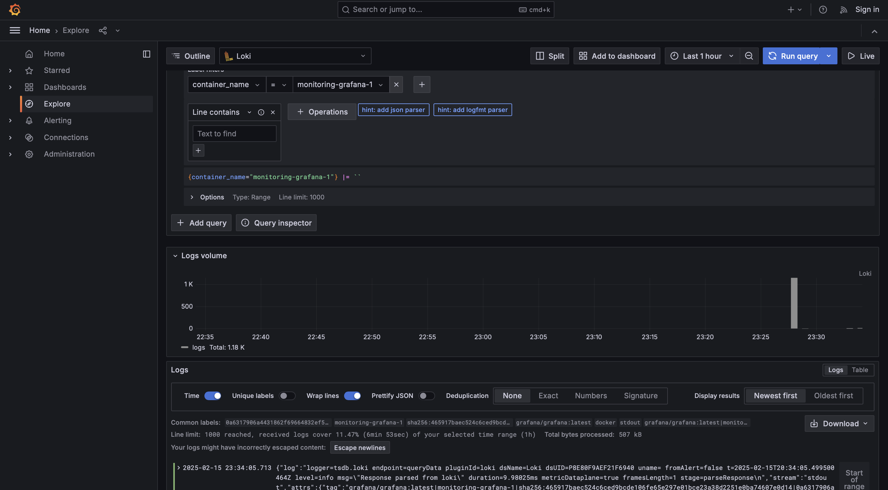
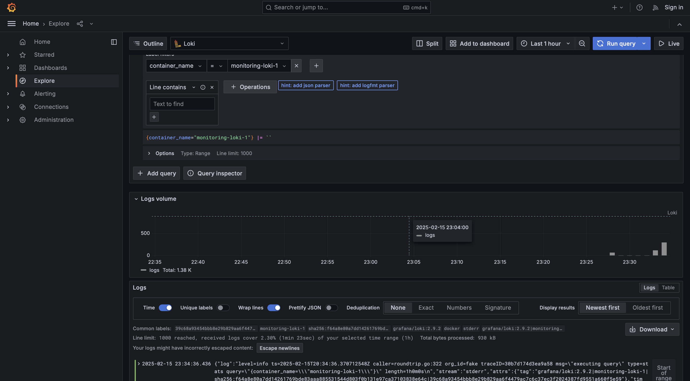
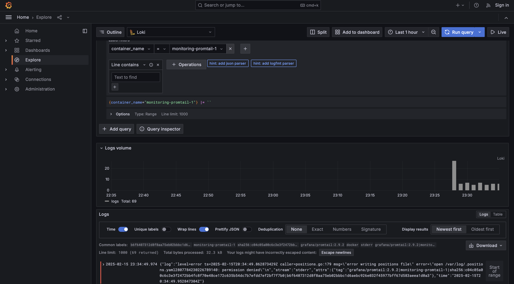
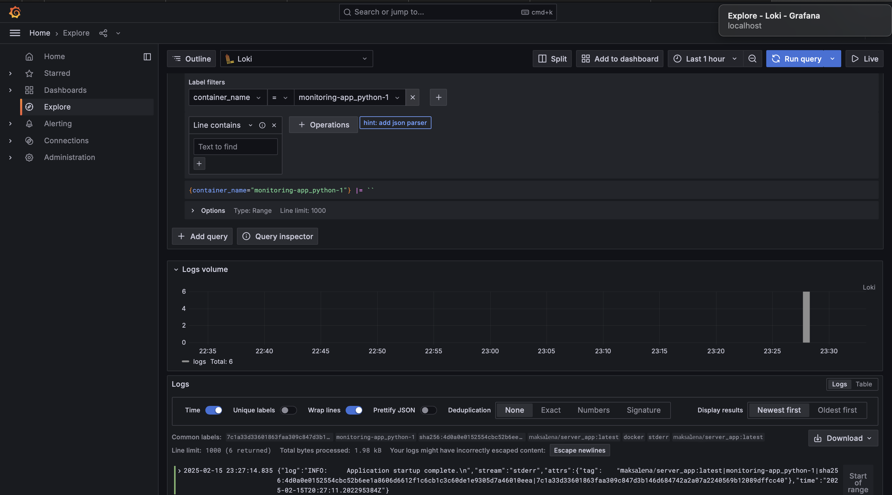

# Logging

## Logging stack

### Graphana

Grafana is an open-source analytics and monitoring platform. It allows users to visualize and explore data using interactive dashboards with charts, graphs, and alerts. Grafana supports multiple data sources and helps centralize observability for better decision-making.

### Loki

Loki is a log aggregation system designed to efficiently collect, store, and query logs from applications and infrastructure. It helps centralize log management without requiring extensive indexing, making it lightweight and scalable.

### Promtail

Promtail is a log agent that collects logs from local sources and forwards them to a Loki instance. In this setup, a custom configuration file (./promtail-conf.yaml) is used to gather logs from all containers specified in the docker-compose.yml file.

## Loggs

### Graphana

### Loki

### Promtail

### App Python

