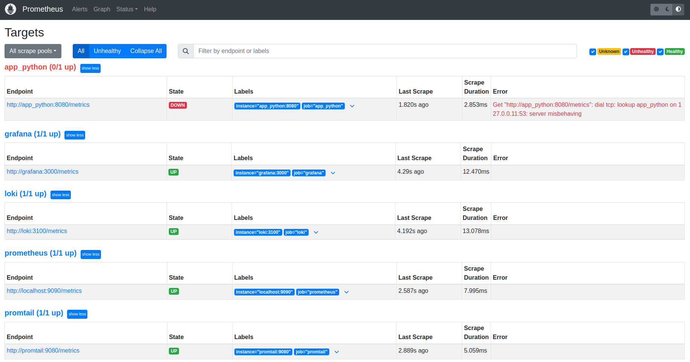
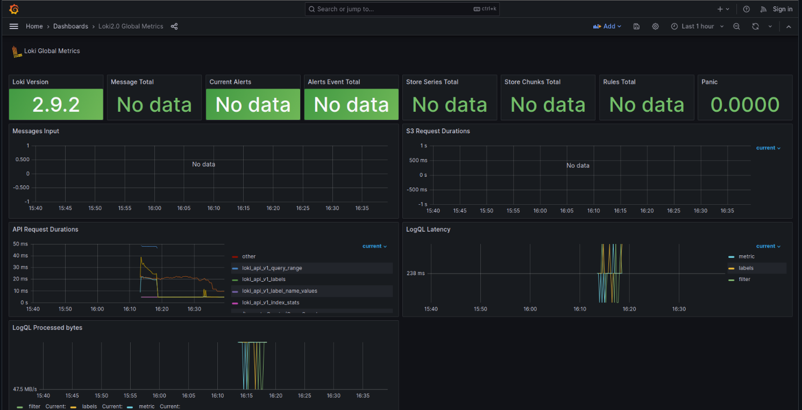
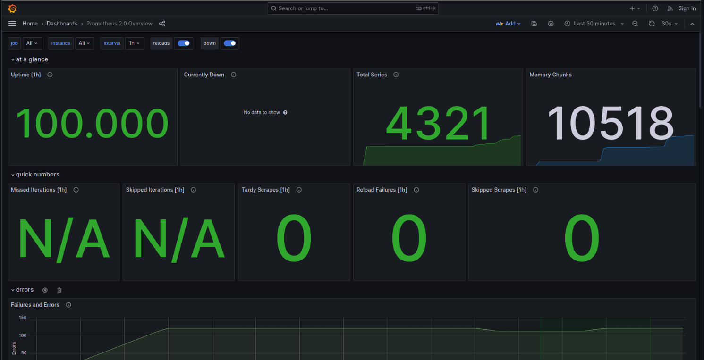

# Metrics

## Prometheus Targets



## Grafana dashboards

### Loki



### Prometheus



## Service Configuration

### Log rotation

Update options of `logger`

```shell
options:
    max-size: "100m"
    max-file: "2"
    tag: "{{.ImageName}}|{{.Name}}|{{.ImageFullID}}|{{.FullID}}"
```

### Memory limits

Update services to specify memory limits

```shell
deploy:
  resources:
    limits:
      memory: "512M"
```

### Metrics

Services are configured to provide metrics and healthchecks
